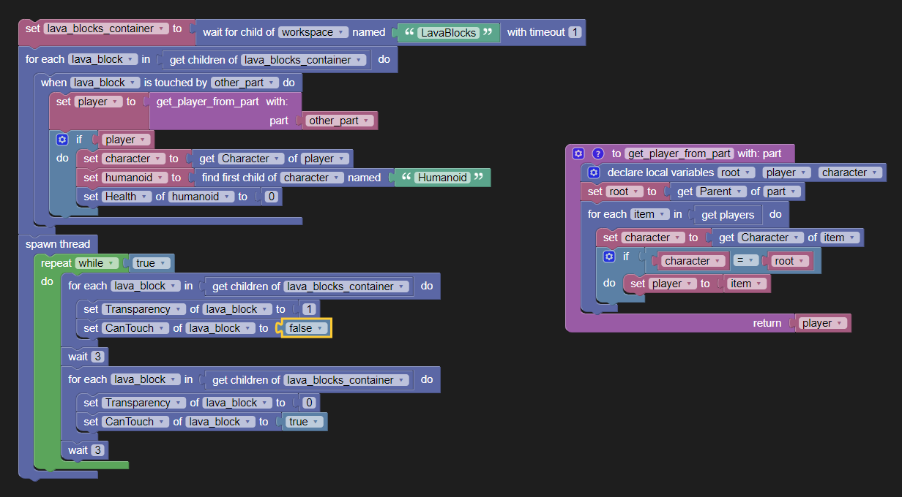

# Timed Lava

Based on [this question](https://www.reddit.com/r/ROBLOXStudio/comments/tkb74y/how_do_i_create_timed_lava_like_this_is_roblox/i1t91nc/?context=3) from reddit.

The following script will add lava behavior to all child blocks in the parent folder "LavaBlocks".
All source code is saved in the roblox studio file in this folder.

  